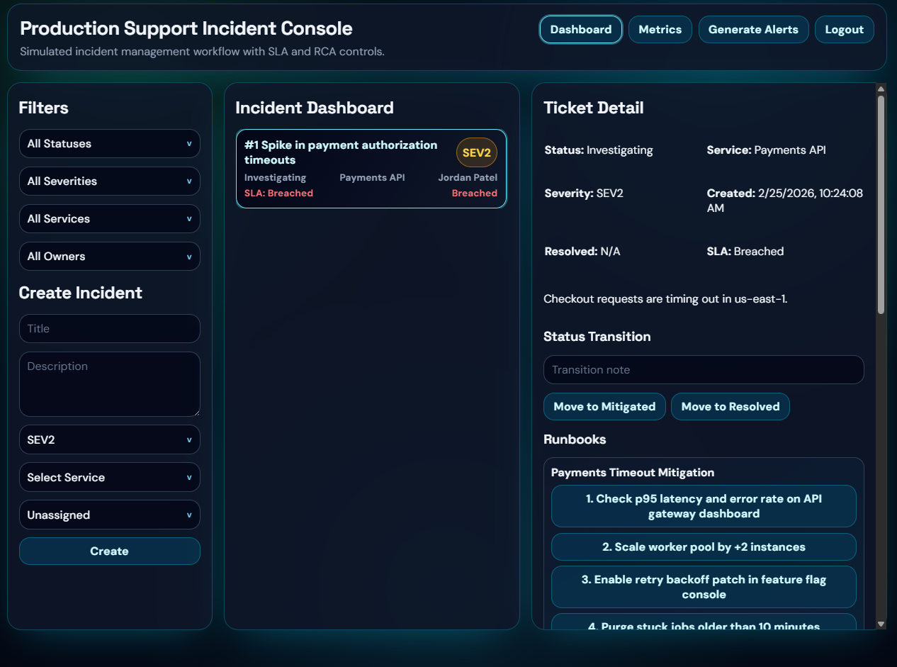

# Production Support Incident Console

A production-grade incident management console implementing real SRE workflows:
- Incident intake and triage
- SLA tracking and breach visibility
- Runbook-driven mitigation logging
- RCA-gated closure
- Post-incident reporting and operational metrics

Live demo (hosted on Render): [https://incident-console-ui.onrender.com/](https://incident-console-ui.onrender.com/)



## Why I Built This

Built to demonstrate production-grade incident management workflows that mirror real SRE/DevOps environments.  
The goal was to model how incidents are actually handled end-to-end, including SLA enforcement, runbook-driven mitigation, RCA-gated closure, and operational metrics like MTTA and MTTR.

## Stack

- Backend: FastAPI + SQLAlchemy
- Database: PostgreSQL-compatible schema (defaults to SQLite for local run)
- Frontend: React + TypeScript + Vite
- Auth: JWT
- Charts: Recharts

## Architecture

- `frontend/`: React UI for dashboard, incident detail, runbooks, RCA, and metrics.
- `backend/`: FastAPI API with lifecycle workflow rules, audit events, SLA logic, and report export.
- Backend computes SLA and metrics server-side to keep workflow logic authoritative.

## ERD

```text
users
  id (PK)
  name
  username
  password
  role

services
  id (PK)
  name
  owner_team
  sla_policy (JSON)

runbooks
  id (PK)
  service_id (FK -> services.id)
  title
  steps_json (JSON)

incidents
  id (PK)
  title
  description
  severity
  status
  service_id (FK -> services.id)
  assignee_id (FK -> users.id, nullable)
  created_at
  acknowledged_at (nullable)
  resolved_at (nullable)
  closed_at (nullable)

incident_events
  id (PK)
  incident_id (FK -> incidents.id)
  type
  body
  created_by (FK -> users.id, nullable)
  created_at

rcas
  id (PK)
  incident_id (FK -> incidents.id, unique)
  root_cause
  contributing_factors
  corrective_actions
  prevention_actions
```

## Feature Coverage

- Incident dashboard with `status`, `severity`, `service`, `owner` filters
- Lifecycle transitions: `New -> Investigating -> Mitigated -> Resolved -> Closed`
- SLA deadline and breach state per severity policy
- Ticket detail page with timeline/events/comments
- Runbook linking per service with one-click step application logging
- RCA template required before closure
- Post-incident export as Markdown (`/incidents/{id}/report.md`)
- Metrics panel (`MTTA`, `MTTR`, breach rate)
- Stretch: synthetic alert generator (`/alerts/generate`)

## Local Run

### 1) Backend

```bash
cd backend
python -m venv .venv
.venv\Scripts\activate
pip install -r requirements.txt
uvicorn app.main:app --reload
```

Backend URL: `http://127.0.0.1:8000`

Optional PostgreSQL:
- Set `DATABASE_URL` in `backend/.env` (example in `backend/.env.example`)
- Install driver (`psycopg`) and point to your instance.

### 2) Frontend

```bash
cd frontend
npm install
npm run dev
```

Frontend URL: `http://127.0.0.1:5173`
Frontend calls backend through Vite proxy at `/api`.

## Live Demo (One Command with Docker)

This starts a production-like demo stack with seeded data and one public app URL.

```bash
docker compose -f docker-compose.demo.yml up --build
```

Demo URL: `http://127.0.0.1:8080`

What this runs:
- `backend`: FastAPI on internal port `8000` with seeded SQLite at Docker volume `demo_db`
- `frontend`: Nginx serving the React build and reverse-proxying `/api/*` to backend

Stop demo:

```bash
docker compose -f docker-compose.demo.yml down
```

Reset demo data:

```bash
docker compose -f docker-compose.demo.yml down -v
```

## Live Demo on Render

This repo includes a Render Blueprint: [`render.yaml`](./render.yaml).
Live demo (hosted on Render): [https://incident-console-ui.onrender.com/](https://incident-console-ui.onrender.com/)

1. Push this repo to GitHub.
2. In Render, choose `New +` -> `Blueprint`, then select your repo.
3. Render will create:
- `incident-console-api` (FastAPI web service)
- `incident-console-ui` (static site)
4. During setup, provide:
- `VITE_API_BASE` on `incident-console-ui`: set to your backend public URL (example: `https://incident-console-api.onrender.com`)
- `CORS_ORIGINS` on `incident-console-api`: set to your frontend URL (example: `https://incident-console-ui.onrender.com`)

After deploy, open the frontend URL and use demo credentials below.

## Live Demo on Railway

Create two Railway services from this same repo:

1. `incident-console-api`
- Root directory: `backend`
- Build command: `pip install -r requirements.txt`
- Start command: `uvicorn app.main:app --host 0.0.0.0 --port $PORT`
- Env vars:
  - `JWT_SECRET` = any strong value
  - `DATABASE_URL` = `sqlite:///./incident_console.db`
  - `CORS_ORIGINS` = your frontend domain (comma-separated if multiple)

2. `incident-console-ui`
- Root directory: `frontend`
- Build command: `npm ci && npm run build`
- Start command: `npm run preview -- --host 0.0.0.0 --port $PORT`
- Env vars:
  - `VITE_API_BASE` = backend public URL from service 1

Then open the frontend public domain and run the demo script.

## Tests

Backend:

```bash
cd backend
pytest
```

Frontend:

```bash
cd frontend
npm test
```

## Demo Credentials

- `jordan / demo123` - `incident_commander`
- `avery / demo123` - `engineer`
- `morgan / demo123` - `manager`

Seed data includes users, services, runbooks, and one active incident.

## Demo Script

1. Login as `jordan`.
2. Create a new `SEV2` incident and assign service/owner.
3. Open the incident detail page and transition to `Investigating`.
4. Apply one or more runbook steps and add timeline comments.
5. Transition to `Mitigated`, then `Resolved`.
6. Fill RCA fields and save.
7. Move to `Closed` (closure is blocked if RCA is incomplete).
8. Export report via `Export Post-Incident Report (Markdown)`.
9. Open Metrics tab and review `MTTA`, `MTTR`, and breach rate.

## API Highlights

- `POST /auth/login`
- `GET /incidents` (supports filters)
- `POST /incidents`
- `GET /incidents/{id}`
- `POST /incidents/{id}/status`
- `POST /incidents/{id}/comments`
- `POST /incidents/{id}/apply-runbook-step`
- `PUT /incidents/{id}/rca`
- `GET /incidents/{id}/report.md`
- `GET /metrics`
- `POST /alerts/generate`
